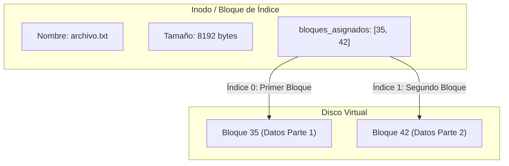

# Estrategia de Asignación de Memoria y Almacenamiento

Este documento detalla el diseño arquitectónico, el diseño del disco virtual y la estrategia de asignación de espacio en disco (comúnmente referida en sistemas operativos como asignación de memoria secundaria) implementada en este proyecto de Sistema de Archivos (File System).

---

## 1. Distribución del Disco Virtual (Disk Layout)

El sistema de archivos simula un disco físico utilizando un archivo binario único (accedido mediante la clase `RandomAccessFile` en Java). Este disco se divide en bloques de tamaño fijo de **4096 bytes (4 KB)**. 

La distribución del disco estructurada en bloques es la siguiente:

| Rango de Bloques | Componente | Descripción |
| :--- | :--- | :--- |
| **Bloque 0** | **MBR (Master Boot Record)** | Contiene la información de partición y metadatos globales del disco. |
| **Bloque 1** | **Partición de Arranque (Boot)** | Bloque reservado para el sector de arranque del sistema. |
| **Bloque 2** | **Superbloque** | Almacena los metadatos críticos del sistema de archivos: nombre del FS, tamaño total, tamaño de bloque, total de bloques y bloques libres actuales. |
| **Bloque 3** | **Reservado** | Bloque de control intermedio reservado. |
| **Bloques 4 - 10** | **Bitmap de Bloques** | Mapa de bits utilizado para gestionar el estado (libre/ocupado) de todos los bloques de datos. |
| **Bloques 11 - 13** | **Reservados** | Espacio reservado para futuras extensiones del sistema. |
| **Bloques 14 - 15** | **Bitmap de Inodos** | Mapa de bits para rastrear cuáles inodos están libres u ocupados en la tabla de inodos. |
| **Bloques 16 - 19** | **Reservados** | Bloques de separación del sistema de archivos. |
| **Bloque 20** | **Inodo Raíz (`/`)** | Inodo base donde se monta el directorio raíz del sistema de archivos. |
| **Bloques 21+** | **Inodos y Datos** | Bloques asignados dinámicamente para almacenar tanto estructuras de inodos (FCB) como bloques de datos de archivos y directorios. |

---

## 2. Estrategia de Asignación de Espacio: Asignación Indexada

Este sistema de archivos utiliza la estrategia de **Asignación Indexada (Indexed Allocation)** para gestionar el espacio asignado a los archivos y directorios.

Estrategia de asignacion de memoria:
1. **Asignación Indexada:** Todos los punteros a los bloques de datos se concentran en un único bloque de índice, conocido en este diseño como **Inodo** (o *File Control Block* - FCB).



### ¿Cómo funciona en el código?

En [Inodo.java](../File_System/src/main/java/Directorios/Inodo.java), cada archivo y directorio está representado por una instancia de `Inodo` que contiene la lista de bloques que le pertenecen:

```java
public List<Integer> bloques_asignados; // Soporta múltiples bloques asignados
```

Cuando el sistema necesita leer o escribir contenido en un archivo:
1. Lee el inodo correspondiente desde el disco.
2. Recupera la lista de bloques de datos asignados (`bloques_asignados`).
3. Para leer el bloque de índice $N$, se calcula su posición absoluta directamente como:
   $$\text{Posición} = \text{bloques\_asignados.get}(N) \times \text{tam\_bloque}$$
4. Realiza un *seek* directo a esa posición en el archivo binario del disco.

### Ventajas de esta Estrategia en el Proyecto

* **Cero Fragmentación Externa:** Los bloques de datos pueden estar dispersos en cualquier lugar del disco. Cualquier bloque libre marcado en el bitmap puede ser asignado instantáneamente al archivo.
* **Acceso Aleatorio Eficiente:** Se puede acceder directamente a cualquier posición de un archivo sin tener que recorrer secuencialmente los bloques anteriores (como ocurriría en la asignación enlazada).
* **Crecimiento Dinámico:** Si un archivo necesita crecer, simplemente se busca un bloque libre en el bitmap de bloques, se marca como ocupado y se añade su número a la lista `bloques_asignados` del inodo.

---

## 3. Gestión de Espacio Libre mediante Mapas de Bits (Bitmaps)

Para identificar qué bloques e inodos están disponibles para su asignación, el sistema de archivos utiliza dos estructuras de mapa de bits:

### A. Bitmap de Bloques (`BitMapBloques`)
Ubicado en los bloques **4 al 10** del disco. 
* Mantiene un arreglo de valores booleanos (`boolean[] bloques`), donde `true` indica que el bloque está ocupado y `false` que está libre.
* Al serializarse a disco, se empaquetan 8 elementos booleanos en un solo byte (usando operaciones a nivel de bits), minimizando el espacio consumido en el disco virtual.

### B. Bitmap de Inodos (`BitMapInodos`)
Ubicado en los bloques **14 al 15** del disco.
* Rastrea el uso de los identificadores de inodo disponibles.
* Evita la colisión de identificadores al crear nuevos archivos o carpetas.

### Proceso de Asignación y Liberación

Cuando se crea un elemento (métodos en [GestorDisco.java](../File_System/src/main/java/Nucleo/GestorDisco.java)):
1. Se invoca a `asignar_inodo_libre()`, el cual lee el bitmap de inodos, localiza el primer bit en `false`, lo marca como `true`, guarda el bitmap en disco y devuelve el índice.
2. Se invoca a `asignar_bloque_libre()`, que realiza el mismo proceso sobre el bitmap de bloques de datos.
3. Se resta 1 al contador de `bloques_libres` en el **Superbloque**.

Al eliminar un elemento:
1. Se recorre la lista `bloques_asignados` del inodo a eliminar y se invoca a `liberar_bloque(bloque)` para marcar cada uno de ellos como libre (`false`) en el bitmap de bloques.
2. Se invoca a `liberar_inodo(inodo.numero - inodo_base)` para liberar su entrada en el bitmap de inodos.
3. Se incrementa el contador de `bloques_libres` en el **Superbloque**.

---

## 4. Estructura y Organización de Directorios

En este sistema de archivos, los directorios son tratados internamente como **archivos especiales**. Su inodo correspondiente tiene el flag `es_directorio = true`.

La asignación indexada de un directorio apunta a bloques de datos que contienen texto plano estructurado. Cada línea de este bloque representa una entrada del directorio (un archivo o subdirectorio contenido en él) con el siguiente formato:

```text
nombre_elemento;tipo_elemento;numero_inodo
```

### Ejemplo de Bloque de Datos de un Directorio:
```text
.;dir;20
..;dir;20
users;dir;21
documento.txt;file;22
```

Donde:
* `.` representa al propio directorio (inodo 20).
* `..` representa al directorio padre (inodo 20, al ser la raíz su padre es sí mismo).
* `users/` es un subdirectorio ubicado en el inodo 21.
* `documento.txt` es un archivo de datos ubicado en el inodo 22.

Para realizar operaciones como `cd`, `ls` o abrir un archivo, el sistema lee el bloque de datos del directorio actual, parsea el texto separando por saltos de línea `\n` y caracteres de división `;`, y localiza el inodo correspondiente al nombre solicitado.

---

## 5. Control de Acceso y Seguridad (Permisos)

Cada inodo almacena un campo entero `permisos` que emula el esquema de permisos octales de los sistemas Unix/Linux (por ejemplo, `77` o `777`).

### Validación de Permisos (`validar_permisos`)
El sistema valida los permisos antes de realizar cualquier lectura, escritura o ejecución sobre un archivo o directorio:
1. **Usuario Root (UID = 1):** Tiene acceso absoluto de forma incondicional.
2. **Propietario:** Si el UID del usuario actual coincide con `inodo.propietario`, se aplican los permisos del dígito de las decenas (ej. en `75`, el propietario tiene permiso `7`).
3. **Grupo:** Si el GID del usuario actual coincide con `inodo.grupo` (o está en sus grupos secundarios), se aplican los permisos del dígito de las unidades (ej. en `75`, el grupo tiene permiso `5`).

### Operaciones soportadas:
* **Lectura (`read` - bit 4):** Permite leer el bloque de datos del archivo o listar un directorio.
* **Escritura (`write` - bit 2):** Permite modificar el contenido de un archivo o crear/eliminar entradas dentro de un directorio.
* **Ejecución (`execute` - bit 1):** Requerido para ingresar a un directorio (`cd`).
